# ai-images

A collection of Google Colab notebooks exploring AI image generation and computer vision, including text-to-image synthesis, VAE encode/decode, and image recognition.

## Notebooks

| Notebook | Description |
|---|---|
| [`diffusers_generator.ipynb`](diffusers_generator.ipynb) | Text-to-image generation using [Stable Diffusion 3.5 Medium](https://huggingface.co/stabilityai/stable-diffusion-3.5-medium) |
| [`decode_encode.ipynb`](decode_encode.ipynb) | VAE encode/decode demo — compress an image to latent space and reconstruct it |
| [`image_recognition.ipynb`](image_recognition.ipynb) | Image classification using a pre-trained Vision Transformer (ViT) |

---

## 1. Text-to-Image Generation (`diffusers_generator.ipynb`)

Generates images from text prompts using [Stable Diffusion 3.5 Medium](https://huggingface.co/stabilityai/stable-diffusion-3.5-medium) via the Hugging Face [diffusers](https://github.com/huggingface/diffusers) library.

### Features

- Text-to-image generation using Stable Diffusion 3.5 Medium
- Memory-optimized for free-tier GPU (T4) in Google Colab
- Configurable prompt, image size, inference steps, and guidance scale

### Prerequisites

- A [Hugging Face](https://huggingface.co/) account and access token
- Google Colab (free tier with T4 GPU is sufficient)

### Getting Started

1. Open the notebook in Google Colab by clicking the badge below:

   [](https://colab.research.google.com/github/sujithkumarmp/ai-images/blob/main/diffusers_generator.ipynb)

2. Run the first cell to install the required dependencies:
   ```
   pip install -U diffusers transformers accelerate torch
   ```

3. Log in to Hugging Face with your access token when prompted.

4. Update the `prompt` variable with your desired image description.

5. Run the generation cell — the output image will be saved as `output_image.png`.

### Dependencies

| Package        | Purpose                              |
|----------------|--------------------------------------|
| `diffusers`    | Stable Diffusion pipeline            |
| `transformers` | Model components & tokenizers        |
| `accelerate`   | Memory optimization / CPU offloading |
| `torch`        | Deep learning backend                |

### Example Output

Prompt: *"A steampunk robotic owl perched on a crystal branch, digital art, 8k"*


### Configuration

| Parameter            | Default | Description                         |
|----------------------|---------|-------------------------------------|
| `num_inference_steps`| 28      | Number of denoising steps           |
| `guidance_scale`     | 7.0     | How closely to follow the prompt    |
| `width` / `height`   | 768     | Output image resolution in pixels   |

> **Note:** Using a resolution of 768×768 is recommended for T4 GPUs (16 GB VRAM) to avoid out-of-memory errors. Increase to 1024×1024 if a higher-memory GPU is available (e.g., V100 or A100 with 16 GB+ VRAM).

### How Diffusion Models Work

#### Flow Diagram — End-to-End Generation

The following diagram shows how a text prompt is transformed into an image through the reverse diffusion (denoising) process:

```mermaid
flowchart TD
    A([User Text Prompt]) --> B[Text Encoders\nCLIP-L · CLIP-G · T5-XXL]
    B --> C[Prompt Embeddings\n& Pooled Embeddings]

    D([Random Gaussian Noise\nLatent z_T]) --> E

    C --> E[/Denoising Loop\nfor t = T … 1/]
    E --> G[Diffusion Transformer\nMMDiT — predicts noise]
    G --> H[Scheduler\ncomputes z_t-1 from z_t]
    H --> I{t = 1?}
    I -- No, continue --> E
    I -- Yes --> J[VAE Decoder\nlatent → pixel space]
    J --> K([Output Image 🖼️])
```



> **Key idea:** Starting from pure noise `z_T`, the model iteratively removes noise guided by the text embeddings over `num_inference_steps` denoising steps until a clean latent `z_0` is produced. The VAE then decodes `z_0` into the final pixel-space image.

---

#### Component Diagram — SD 3.5 Pipeline

The diagram below shows the main components of the `StableDiffusion3Pipeline` used in this project and how they connect:


| Component | Role |
|-----------|------|
| **CLIP-L / CLIP-G** | Encode the text prompt into token-level and pooled embeddings |
| **T5-XXL** | Provides richer language understanding for complex prompts |
| **MMDiT (Transformer)** | Predicts the noise to remove at each denoising step |
| **Scheduler** | Controls the noise level at each step and computes the next latent |
| **VAE Decoder** | Converts the final denoised latent back into a full-resolution image |

---

## 2. VAE Decode / Encode (`decode_encode.ipynb`)

Demonstrates how a Variational Autoencoder (VAE) compresses an image into a compact latent representation and then reconstructs it — the same encoding/decoding process used inside every Stable Diffusion model.

### What it does

1. Loads the VAE from `runwayml/stable-diffusion-v1-5` via the `diffusers` library.
2. Downloads a sample image and resizes it to 512×512.
3. **Encodes** the image to a 4-channel, 64×64 latent tensor (8× spatial compression).
4. **Decodes** the latent back to a full-resolution image and displays it.

### Open in Colab

[](https://colab.research.google.com/github/sujithkumarmp/ai-images/blob/main/decode_encode.ipynb)

### Key concept

```
Image [1, 3, 512, 512]  →  VAE Encoder  →  Latent [1, 4, 64, 64]
Latent [1, 4, 64, 64]   →  VAE Decoder  →  Image  [1, 3, 512, 512]
```

The latent space is 8× smaller in each spatial dimension, which is why diffusion models operate in latent space — it is far cheaper to denoise a 64×64 tensor than a 512×512 image.

### Dependencies

| Package        | Purpose                                  |
|----------------|------------------------------------------|
| `diffusers`    | `AutoencoderKL` VAE implementation       |
| `torch`        | Deep learning backend                    |
| `torchvision`  | Image transforms                         |
| `Pillow`       | Image loading and display                |
| `requests`     | Downloading the sample image             |

---

## 3. Image Recognition (`image_recognition.ipynb`)

Classifies an image using a pre-trained **Vision Transformer (ViT-B/16)** from `torchvision`, trained on ImageNet-1K.

### What it does

1. Loads `vit_b_16` with `IMAGENET1K_V1` weights.
2. Downloads a sample image from the web.
3. Pre-processes it (resize → center-crop to 224×224 → normalize).
4. Runs a forward pass and prints the predicted ImageNet class index.

### Open in Colab

[](https://colab.research.google.com/github/sujithkumarmp/ai-images/blob/main/image_recognition.ipynb)

### Example output

```
Prediction index: 207
```

> ImageNet class 207 is **golden retriever** 🐕 — matching the dog image used as input.

### Dependencies

| Package       | Purpose                                        |
|---------------|------------------------------------------------|
| `torch`       | Deep learning backend                          |
| `torchvision` | Pre-trained ViT model and image transforms     |
| `Pillow`      | Image loading                                  |
| `requests`    | Downloading the sample image                   |

---

## License

This project is open source. See the repository for details.
