# ai-images

A Google Colab notebook for generating AI images using [Stable Diffusion 3.5 Medium](https://huggingface.co/stabilityai/stable-diffusion-3.5-medium) via the Hugging Face [diffusers](https://github.com/huggingface/diffusers) library.

## Features

- Text-to-image generation using Stable Diffusion 3.5 Medium
- Memory-optimized for free-tier GPU (T4) in Google Colab
- Configurable prompt, image size, inference steps, and guidance scale

## Prerequisites

- A [Hugging Face](https://huggingface.co/) account and access token
- Google Colab (free tier with T4 GPU is sufficient)

## Getting Started

1. Open the notebook in Google Colab by clicking the badge below:

   [](https://colab.research.google.com/github/sujithkumarmp/ai-images/blob/main/diffusers_generator.ipynb)

2. Run the first cell to install the required dependencies:
   ```
   pip install -U diffusers transformers accelerate torch
   ```

3. Log in to Hugging Face with your access token when prompted.

4. Update the `prompt` variable with your desired image description.

5. Run the generation cell — the output image will be saved as `output_image.png`.

## Dependencies

| Package        | Purpose                              |
|----------------|--------------------------------------|
| `diffusers`    | Stable Diffusion pipeline            |
| `transformers` | Model components & tokenizers        |
| `accelerate`   | Memory optimization / CPU offloading |
| `torch`        | Deep learning backend                |

## Example Output

Prompt: *"A steampunk robotic owl perched on a crystal branch, digital art, 8k"*


## Configuration

| Parameter            | Default | Description                         |
|----------------------|---------|-------------------------------------|
| `num_inference_steps`| 28      | Number of denoising steps           |
| `guidance_scale`     | 7.0     | How closely to follow the prompt    |
| `width` / `height`   | 768     | Output image resolution in pixels   |

> **Note:** Using a resolution of 768×768 is recommended for T4 GPUs (16 GB VRAM) to avoid out-of-memory errors. Increase to 1024×1024 if a higher-memory GPU is available (e.g., V100 or A100 with 16 GB+ VRAM).

## How Diffusion Models Work

### Flow Diagram — End-to-End Generation

The following diagram shows how a text prompt is transformed into an image through the reverse diffusion (denoising) process:

```mermaid
flowchart TD
    A([User Text Prompt]) --> B[Text Encoders\nCLIP-L · CLIP-G · T5-XXL]
    B --> C[Prompt Embeddings\n& Pooled Embeddings]

    D([Random Gaussian Noise\nLatent z_T]) --> E

    C --> E[/Denoising Loop\nfor t = T … 1/]
    E --> G[Diffusion Transformer\nMMDiT — predicts noise]
    G --> H[Scheduler\ncomputes z_t-1 from z_t]
    H --> I{t = 1?}
    I -- No, continue --> E
    I -- Yes --> J[VAE Decoder\nlatent → pixel space]
    J --> K([Output Image 🖼️])
```



> **Key idea:** Starting from pure noise `z_T`, the model iteratively removes noise guided by the text embeddings over `num_inference_steps` denoising steps until a clean latent `z_0` is produced. The VAE then decodes `z_0` into the final pixel-space image.

---

### Component Diagram — SD 3.5 Pipeline

The diagram below shows the main components of the `StableDiffusion3Pipeline` used in this project and how they connect:

```mermaid
graph LR
    subgraph Encoders["Text Encoders"]
        CLIP_L[CLIP-L]
        CLIP_G[CLIP-G]
        T5[T5-XXL]
    end

    subgraph Core["Stable Diffusion 3.5 Pipeline"]
        TR[Diffusion Transformer\nMMDiT]
        SC[Scheduler\nFlowMatchEulerDiscreteScheduler]
        VAE[VAE Decoder]
    end

    Prompt([Text Prompt]) --> CLIP_L & CLIP_G & T5
    CLIP_L & CLIP_G & T5 -->|embeddings| TR
    Noise([Random Noise]) -->|latent z_T| TR
    SC -->|noise level σ_t| TR
    TR -->|denoised latent z_0| VAE
    VAE --> Image([Output Image 🖼️])
```



| Component | Role |
|-----------|------|
| **CLIP-L / CLIP-G** | Encode the text prompt into token-level and pooled embeddings |
| **T5-XXL** | Provides richer language understanding for complex prompts |
| **MMDiT (Transformer)** | Predicts the noise to remove at each denoising step |
| **Scheduler** | Controls the noise level at each step and computes the next latent |
| **VAE Decoder** | Converts the final denoised latent back into a full-resolution image |

## License

This project is open source. See the repository for details.
